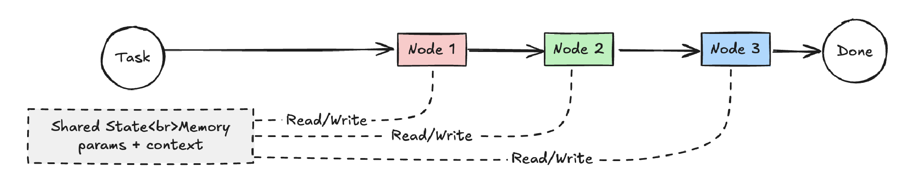
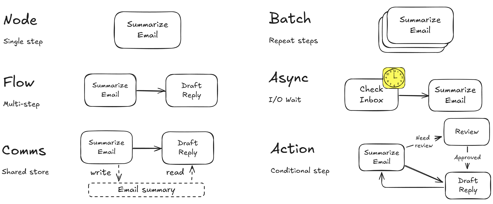
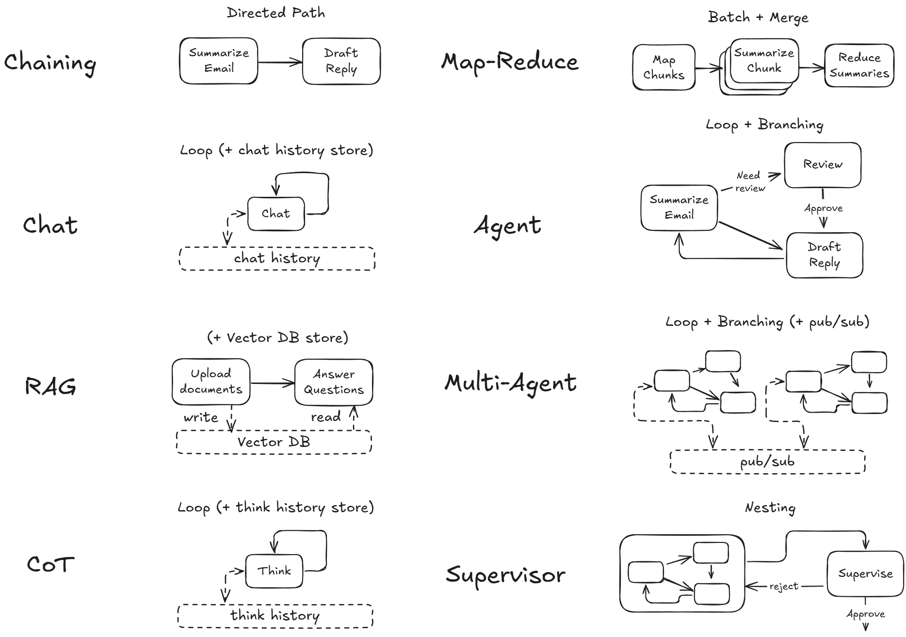

[](https://helenaeverleyz.github.io/pocket/)

# 🚀 Pocket Flow Framework
> Build enterprise-ready AI systems—fast, modular, and vendor-agnostic.

<p align="center">
  
</p>

## Why Pocket Flow?
Enterprises need automation. The [typescript LLM framework](pocket/src/pocket.ts) capture what we see as the core abstraction of most LLM frameworks: A **Nested Directed Graph** that breaks down tasks into multiple (LLM) steps, with branching and recursion for agent-like decision-making.

<p align="center">
  
</p>

From there, it's easy to layer on more complex features like [Multi-Agents](https://the-pocket-world.github.io/Pocket-Flow-Framework/multi_agent/), [Prompt Chaining](https://the-pocket-world.github.io/Pocket-Flow-Framework/decomp/), [RAG](https://the-pocket-world.github.io/Pocket-Flow-Framework/rag/), etc.

<p align="center">
  
</p>

## ✨ Features
- 🔄 **Nested Directed Graph** - Each "node" is a simple, reusable unit
- 🔓 **No Vendor Lock-In** - Integrate any LLM or API without specialized wrappers  
- 🔍 **Built for Debuggability** - Visualize workflows and handle state persistence

## Get Started
1. **Clone the Repo**  
   ```bash
   git clone https://github.com/helenaeverleyz/pocket.git
   cd pocket

2. Check out documentation: https://the-pocket-world.github.io/Pocket-Flow-Framework/
