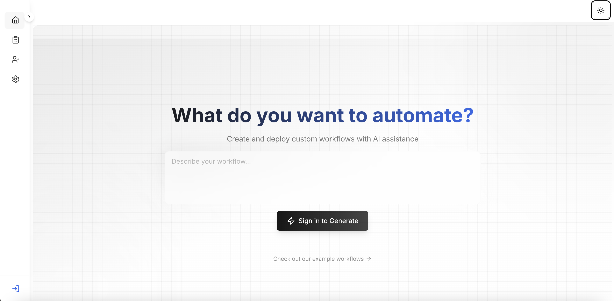

[](https://opensource.org/licenses/MIT)  
[](https://the-pocket-world.github.io/Pocket-Flow-Framework/)

# 🚀 Pocketflow Framework

**The original core abstraction behind the [Pocketflow Platform](https://pocketflow.ai/)**  
Enabling non‑developers to create custom AI workflows with natural language.

## Overview

This repo contains the **original Pocketflow Framework**—the Nested Directed Graph engine that underpins one‑shot workflow generation on Pocketflow. Workflows on the platform wrap around this framework, providing a consistent execution model and state management layer.

We started development in November. The Python version was open‑sourced in December with Zach—who later spun it off as his own project. The TypeScript release followed in February.

## Platform Snapshot

<p align="center">
  
</p>

## Architecture Diagram

<p align="center">
  
</p>

## Why This Framework?

- **Nested Directed Graph**: Breaks complex tasks into reusable nodes with branching and recursion.  
- **One‑Shot Assembly**: Core abstraction powering prompt‑based workflow creation.  

## ✨ Key Features

- **Modular Nodes**: Each node is an independent processing unit.  
- **Vendor‑Agnostic**: Integrate any LLM or API without extra wrappers.  
- **Debug-Friendly**: Inspect state and trace execution paths easily.  

## 📚 Get Started

```bash
git clone https://github.com/The-Pocket-World/Pocket-Flow-Framework.git
cd Pocket-Flow-Framework
