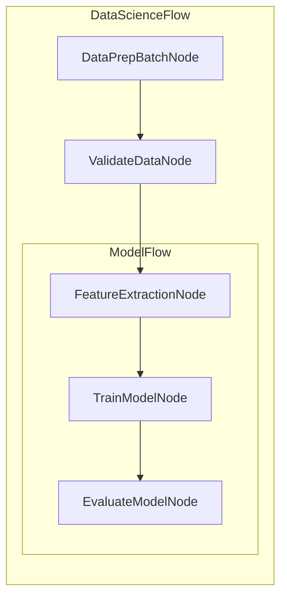

# Visualization and Debugging

We don't provide built-in visualization and debugging. Here are some minimal implementations that can serve as a starting point for your own tooling.

## 1. Visualization with Mermaid

This code recursively traverses the nested graph, assigns unique IDs to each node, and treats Flow nodes as subgraphs to generate Mermaid syntax for a hierarchical visualization.

```typescript
import { BaseNode, Flow } from "../src/pocket";

export function buildMermaid(start: BaseNode | Flow): string {
    const ids = new Map<any, string>();
    const visited = new Set<any>();
    const lines: string[] = ["graph LR"];
    let counter = 1;

    function getId(node: any): string {
        if (!ids.has(node)) {
            ids.set(node, `N${counter++}`);
        }
        return ids.get(node)!;
    }

    function link(a: string, b: string): void {
        lines.push(`    ${a} --> ${b}`);
    }

    function walk(node: any, parent?: string): void {
        if (visited.has(node)) {
            if (parent) link(parent, getId(node));
            return;
        }
        visited.add(node);

        if (node instanceof Flow) {
            if (node.start && parent) {
                link(parent, getId(node.start));
            }
            lines.push(`\n    subgraph sub_flow_${getId(node)}[${node.constructor.name}]`);
            if (node.start) {
                walk(node.start);
            }
            for (const nxt of node.successors.values()) {
                if (node.start) {
                    walk(nxt, getId(node.start));
                } else if (parent) {
                    link(parent, getId(nxt));
                } else {
                    walk(nxt);
                }
            }
            lines.push("    end\n");
        } else {
            const nodeId = getId(node);
            lines.push(`    ${nodeId}["${node.constructor.name}"]`);
            if (parent) link(parent, nodeId);
            for (const nxt of node.successors.values()) {
                walk(nxt, nodeId);
            }
        }
    }

    walk(start);
    return lines.join("\n");
}
```

## 2. Call Stack Debugging

Here's a utility to help debug the execution flow of nodes by tracking the call stack:

```typescript
import { BaseNode } from "../src/pocket";

export function getNodeCallStack(): string[] {
    const stack = new Error().stack?.split("\n").slice(1) || [];
    const nodeNames: string[] = [];
    const seenIds = new Set<number>();
    
    for (const line of stack) {
        const match = line.match(/at (\w+)\.(prep|exec|post)/);
        if (match) {
            const className = match[1];
            if (!seenIds.has(nodeNames.length)) {
                seenIds.add(nodeNames.length);
                nodeNames.push(className);
            }
        }
    }
    
    return nodeNames;
}
```

Example usage:

```typescript
class DataPrepBatchNode extends BaseNode {
    async prepAsync(shared: any): Promise<void> { return; }
}
class ValidateDataNode extends BaseNode {}
class FeatureExtractionNode extends BaseNode {}
class TrainModelNode extends BaseNode {}
class EvaluateModelNode extends BaseNode {
    async prepAsync(shared: any): Promise<void> {
        const stack = getNodeCallStack();
        console.log("Call stack:", stack);
    }
}
class ModelFlow extends Flow {}
class DataScienceFlow extends Flow {}

// Build the flow
const featureNode = new FeatureExtractionNode();
const trainNode = new TrainModelNode();
const evaluateNode = new EvaluateModelNode();

featureNode.addSuccessor(trainNode, "default");
trainNode.addSuccessor(evaluateNode, "default");

const modelFlow = new ModelFlow(featureNode);

const dataPrepNode = new DataPrepBatchNode();
const validateNode = new ValidateDataNode();

dataPrepNode.addSuccessor(validateNode, "default");
validateNode.addSuccessor(modelFlow, "default");

const dataScienceFlow = new DataScienceFlow(dataPrepNode);

// Run the flow
dataScienceFlow.run({});
```

This will output a visualization like:



And when running the flow, you'll see the call stack output showing the execution path through your nodes.


